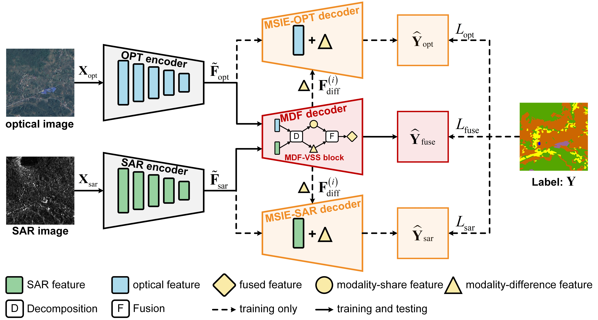

# Retain and Enhance Modality-Specific Information for Multimodal Remote Sensing Image Land Use/Land Cover Classification

## Abstract

Multimodal remote sensing (RS) image land use/land cover (LULC) classification using optical and synthetic aperture radar (SAR) images has raised attention for recent studies. 
Current methods primarily employ multimodal fusion operations to directly explore relationships between multimodal features and obtain fused features, leading to the loss of beneficial modality-specific information problem. 
To solve this problem, this study introduces a multimodal feature decomposition and fusion (MDF) approach combined with a visual state space (VSS) block, namely MDF-VSS block. 
The MDF-VSS block emphasizes beneficial modality-specific information and perceives shared land cover information through modality-difference and modality-share features, which are then adaptively integrated to obtain discriminative fused features. 
Based on the MDF-VSS block, an MDF decoder is designed to retain beneficial multiscale modality-specific information. 
Then, a multimodal specific information enhancement (MSIE) decoder is designed to perform modality-difference feature guided auxiliary classification tasks, further enhancing modality-specific information that is expert in classification. 
Combining the MDF and MSIE decoders, a novel retain-enhance fusion network (REF-Net) is proposed to retain and enhance modality-specific information that benefits classification, thus improving the performance of multimodal RS image LULC classification. 
Extensive experimental results obtained on three public datasets demonstrate the effectiveness of the proposed REF-Net. 

## Overview

### Pipeline

<p align="center">
  
</p>

### MDF-VSS Block

<p align="center">
  
</p>

## Getting Started

### Requirements

The code depends on `selective_scan==0.0.2`, and the source file is located in `core/models/vmamba/kernels`. 
For detailed instructions on compiling, please refer to the VMamba repository:

- [VMamba Paper](https://arxiv.org/abs/2401.10166)
- [VMamba GitHub Repository](https://github.com/MzeroMiko/VMamba)

### Training on DFC20 Dataset

To train the model on the DFC20 dataset, use the following command:

```bash
python3 engine/train_val.py --config cfgs/dfc20/dfc20_bs8_linknet_vssm_mtdecoder_dif_smooth_dsm_w0.005_res50.yaml
```


## Citation

If this work is helpful to your research, please cite it as follows:
```
@ARTICLE{wei2025retain,
  author={Wei, Tianyu and Chen, He and Liu, Wenchao and Chen, Liang and Wang, Jue},
  journal={IEEE Transactions on Geoscience and Remote Sensing}, 
  title={Retain and Enhance Modality-Specific Information for Multimodal Remote Sensing Image Land Use/Land Cover Classification}, 
  year={2025},
  volume={63},
  number={},
  pages={1-18},
  keywords={Optical imaging;Decoding;Optical sensors;Context modeling;Optical reflection;Land surface;Computational modeling;Adaptive optics;Visualization;Synthetic aperture radar;Land use/land cover (LULC) classification;modality-specific information;multimodal;optical;remote sensing (RS);synthetic aperture radar (SAR)},
  doi={10.1109/TGRS.2025.3591926}}
```
If you have any question, please email to me (weity@bit.edu.cn).


## Acknowledgment

This project is based on the following works:

- Segmentation Models Pytorch ([Github Code](https://github.com/qubvel-org/segmentation_models.pytorch)) 
- VMamba ([Paper](https://arxiv.org/abs/2401.10166), [Github Code](https://github.com/MzeroMiko/VMamba))

Thanks for their excellent works.